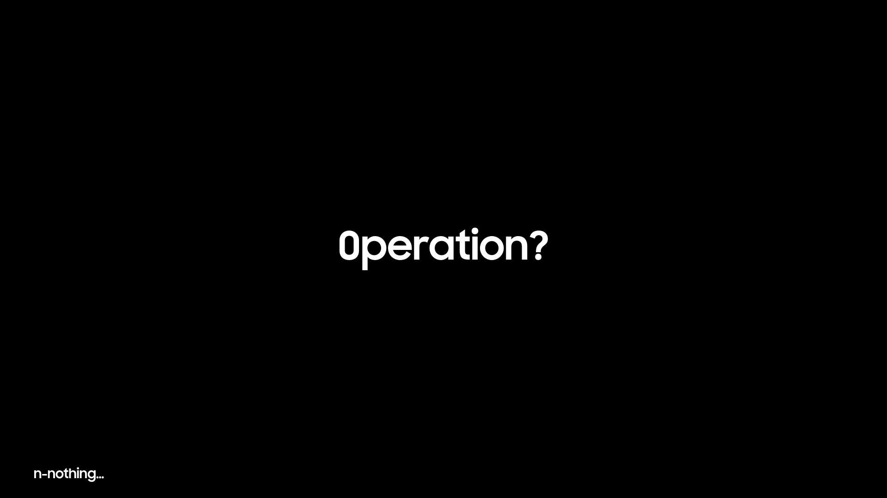

**ROM Feature:**

- Heavily debloated for smooth use.

- Bypassed screenshot detection.

- Secure folder support.

- With Galaxy AI.

- And much more!

## Licensing
This project is licensed under the **MIT License** - see the [LICENSE](LICENSE) file for details.
- **[android-tools](https://github.com/nmeum/android-tools)** - Licensed under Apache License 2.0
- **[apktool](https://github.com/iBotPeaches/Apktool)** - Licensed under Apache License 2.0  
- **[erofs-utils](https://github.com/sekaiacg/erofs-utils)** - Dual licensed (GPL-2.0, Apache-2.0)
- **[platform_build](https://android.googlesource.com/platform/build)** - Licensed under Apache License 2.0
- **[e2fsprogs](https://github.com/tytso/e2fsprogs)** - Licensed under GPL-2.0 / LGPL-2.1
- **[img2sdat](https://github.com/xpirt/img2sdat)** - licensed under the MIT License
## 

**For get latest OneUI roms check:**

**LumiROM Channel:** https://t.me/LumiROMs

**LumiROM Group:** https://t.me/lumiromgroup

## 

Right Now on beta, as i'm including things yet

**P.S: This is hard, very hard because I dont use AI to do the script**

## Credits?
[Lumi]: base script (ig)

**Notes from [nc4tt]: maybe this will be delay a bit bc i'm ready for a huge examination!**
